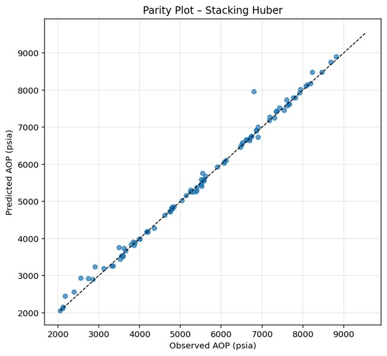
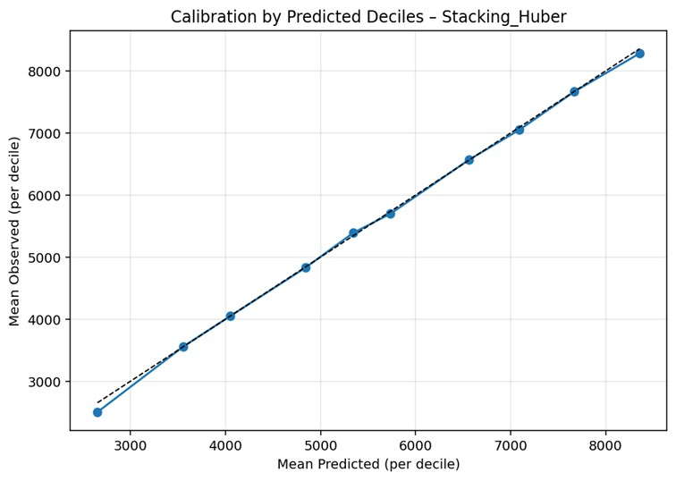
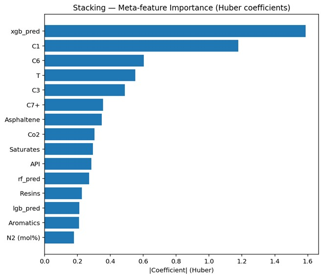

<div align="center">

# Asphaltene Onset Pressure — Ensemble ML Prediction

*A rigorous machine-learning pipeline for predicting **AOP** from reservoir fluid composition,*  
*combining gradient-boosted trees, bagging ensembles, and Huber-regularized meta-learners.*

[](https://www.python.org/)
[](https://scikit-learn.org/)
[](https://xgboost.readthedocs.io/)
[](https://optuna.org/)

</div>

---

## Overview

Asphaltene deposition is one of the most operationally critical flow assurance challenges in upstream petroleum engineering. Accurate prediction of the **Asphaltene Onset Pressure (AOP)** — the reservoir pressure below which asphaltene aggregation initiates — is essential for designing inhibition programs and avoiding costly wellbore plugging.

This repository implements a full supervised-learning pipeline for AOP prediction from reservoir fluid composition (gas fraction, SARA characterization, and thermodynamic state variables). Six models are trained, tuned, and rigorously compared: four base learners and two homogeneous ensemble meta-learners built on top of them.

---

## Methodology

### Base Learners

Four diverse base models are independently optimised on the training set using **5-fold cross-validation** (negative MAE objective). Each is wrapped in a `Pipeline` with `RobustScaler` to accommodate different feature scales:

<div align="center">

| Model | Library |
|:---:|:---:|
| XGBoost | `xgboost` |
| LightGBM | `lightgbm` |
| Extra Trees | `scikit-learn` |
| Random Forest | `scikit-learn` |

</div>

### Ensemble Strategies

**Stacking Regressor**
- Built with `StackingRegressor(passthrough=True)`, feeding original features alongside base-model predictions to the meta-learner.
- Out-of-fold predictions generated via the same 5-fold CV scheme to prevent data leakage.
- Meta-learner: `HuberRegressor(ε = 1.35, max_iter = 1000)`.

**Blending Regressor**
- Custom `BlendingRegressor` class that holds out a fixed **20%** of training data for meta-learner fitting.
- All base models are retrained on the full training set after meta-learner optimisation.
- Meta-learner: `HuberRegressor(ε = 1.35, max_iter = 1000)`.

### Hyperparameter Optimisation

All base models are tuned with **Optuna** (10 trials per model) over the most influential hyperparameter subspaces. Best-found configurations are carried forward into the final ensemble.

---

## Results

All six models are evaluated on a fully held-out test set. Performance is reported across three complementary metrics: R² (global variance explained), MedAE (robust central tendency), and MAPE (relative error magnitude).

<div align="center">

| Model | R² | MedAE (psia) | MAPE (%) |
|:---|:---:|:---:|:---:|
| **Stacking-Huber** | **0.991** | **42.04** | **1.65** |
| Extra Trees | 0.990 | 45.00 | 1.77 |
| Blending-Huber | 0.989 | 42.94 | 1.91 |
| XGBoost | 0.983 | 88.71 | 2.76 |
| LightGBM | 0.968 | 104.48 | 3.72 |
| Random Forest | 0.949 | 98.98 | 5.10 |

</div>

**Stacking-Huber** achieves the best overall performance, with a MAPE of **1.65%** and R² of **0.991**. Extra Trees follows closely — a consequence of its structural dual randomization in both feature selection and split thresholds, which provides effective regularization on noisy experimental data. Among base learners, XGBoost outperforms both LightGBM and Random Forest by a considerable margin.

> **On the Random Forest MAPE–R² divergence:** Random Forest's R² (0.949) appears moderate, yet its MAPE (5.10%) is disproportionately high. This divergence arises because signed errors partially cancel in R², while MAPE faithfully captures the magnitude of systematic underestimation in specific pressure regimes. Calibration analysis confirms a characteristic **S-curve bias** driven by variance shrinkage in ensemble averaging.

---

## Visualisations

### 1 · Parity Plot — Observed vs. Predicted AOP

Parity plots for all six models compare predicted AOP against measured values on the test set. The 45° identity line marks perfect prediction; deviations reflect systematic bias or random scatter.

Stacking-Huber and Blending-Huber maintain the tightest clustering across the full AOP range (2,000–9,500 psia) with no perceptible directional bias at any pressure interval. Extra Trees is effectively indistinguishable from the ensembles in the mid-range (4,000–7,000 psia), with isolated outliers only at the upper extreme where experimental data density decreases. Random Forest exhibits the broadest scatter, with systematic underestimation at lower AOP values and overestimation in the upper range — a hallmark of bagging-based mean regression under distributional imbalance.

<div align="center">
  
  <br/>
  <sub><b>Figure 1.</b> Parity plots for all six models. Points on the dashed diagonal indicate perfect prediction.</sub>
</div>

---

### 2 · Calibration by Predicted Deciles

The test set is partitioned into **10 equal deciles** based on predicted AOP. Mean predicted vs. mean observed AOP is plotted per decile. Alignment with the diagonal indicates conditional unbiasedness across the full prediction range.

XGBoost exhibits near-perfect calibration across all deciles, with predictions that are statistically unbiased conditional on their magnitude — a particularly strong result. Stacking-Huber and Blending-Huber display equivalent quality with only negligible deviations. Extra Trees shows minor oscillation in the mid-deciles, a small price for its strong overall accuracy.

Random Forest follows a pronounced S-shaped calibration curve: observed AOP exceeds predicted values in the lower deciles (< ~4,000 psia) and falls below them in the upper deciles (> ~7,000 psia). This variance shrinkage has direct **operational implications** — applied without correction, Random Forest would systematically underestimate asphaltene risk at lower reservoir pressures and overestimate it at higher pressures, potentially leading to incorrect inhibition program design. LightGBM exhibits a milder version of the same pattern.

<div align="center">
  
  <br/>
  <sub><b>Figure 2.</b> Calibration curves by predicted decile. Ideal calibration corresponds to the diagonal.</sub>
</div>

---

### 3 · Feature Importance — Permutation Importance

Permutation importance (mean drop in R² upon random feature shuffling) is computed for all models on the test set, revealing which compositional and thermodynamic variables most strongly drive AOP prediction.

A consistent divergence emerges between model families. **XGBoost, LightGBM, and Random Forest** rank **C5** as the dominant predictor, reflecting its well-established role in reducing the Hildebrand solubility parameter of the oil mixture beyond a critical threshold — a sharp, nonlinear response that sequential residual fitting detects efficiently. **Extra Trees** inverts this ordering, placing **C1** first: randomized split thresholds smooth over sharp transitions and instead capture C1's broader, continuous influence on oil mixture density and asphaltene solubility.

The **ensemble models** reconcile this disagreement in a physically grounded way. Both Stacking-Huber and Blending-Huber rank **C1** first, yielding an importance profile that is more balanced between C1 and C5 than any individual base model — and one that aligns more naturally with thermodynamic theory, in which both light alkanes act in concert to destabilize asphaltene aggregates by lowering the solubility parameter of the continuous oil phase.

**Temperature** and **saturation pressure** emerge consistently as second-tier contributors. SARA-derived variables — particularly Saturates and Resins — occupy the mid-importance range, corroborating the colloidal stabilization framework in which resins serve as natural peptizing agents for asphaltene aggregates in crude oil.

<div align="center">
  
  <br/>
  <sub><b>Figure 3.</b> Permutation importance for all models. Higher values indicate greater influence on predictive accuracy.</sub>
</div>

---

## How to Run

**1. Install dependencies**

```bash
pip install numpy pandas matplotlib scikit-learn xgboost lightgbm optuna shap joblib openpyxl
```

**2. Add your dataset** to the project root directory.

**3. Train and evaluate all models**

```bash
python train.py
```

---

<div align="center">
  <sub>Developed as part of an MSc thesis in Petroleum Engineering · Amirkabir University of Technology</sub>
</div>
