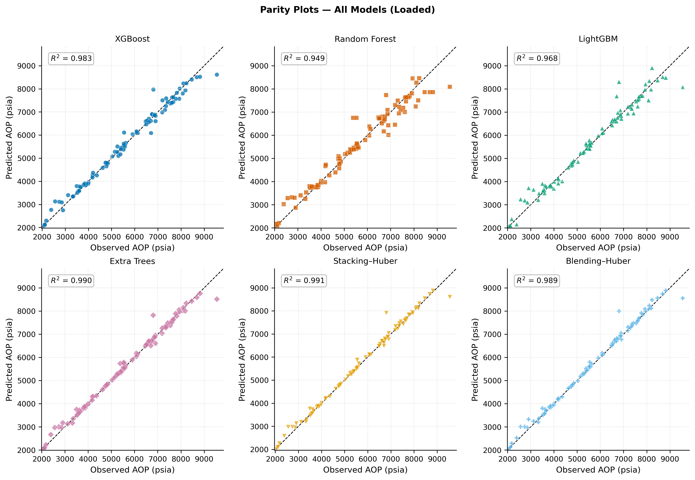
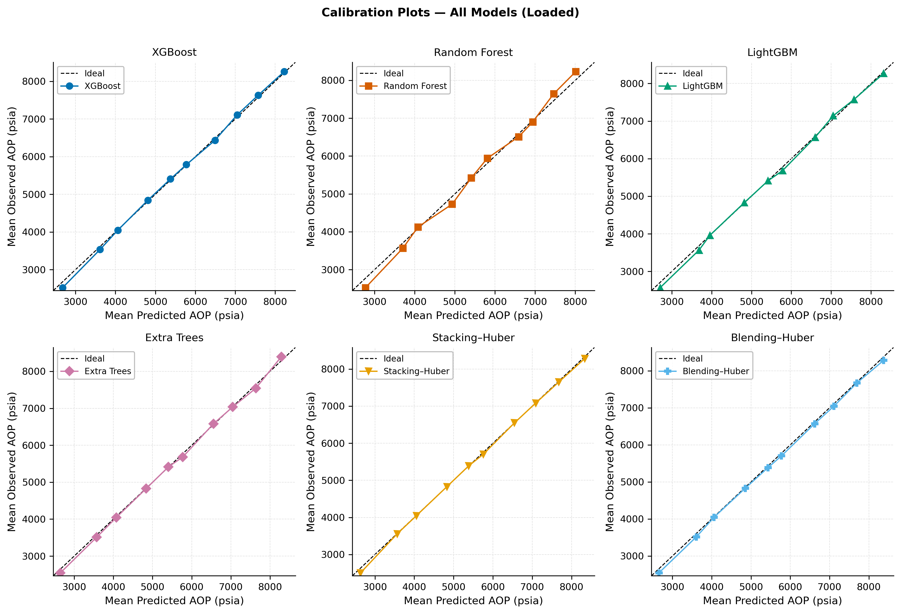
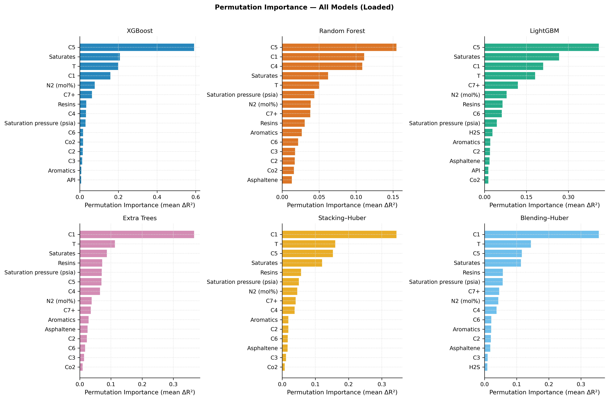

# AOP Ensemble Prediction

Predicting **Asphaltene Onset Pressure (AOP)** from gas composition using a combination of
gradient‑boosted trees, random forests, and two homogeneous ensemble meta‑learners
(Stacking & Blending with Huber regression). The entire pipeline is hyperparameter‑tuned
with **Optuna** and evaluated through rigorous cross‑validation.

---

## Methodology

### Base Models
Four diverse base learners are tuned independently on the training set using
**5‑fold cross‑validation** (negative MAE as the objective):

* **XGBoost**  (`xgboost`)
* **Random Forest** (`scikit-learn`)
* **LightGBM** (`lightgbm`)
* **Extra Trees** (`scikit-learn`)

Each base model is wrapped in a `Pipeline` with a `RobustScaler` to handle different
feature scales.

### Ensemble Techniques
1. **Stacking Regressor**
   * Standard sklearn `StackingRegressor` with `passthrough=True` (original features are
     fed to the meta‑learner alongside the base‑model predictions).
   * The same 5‑fold CV is used to generate out‑of‑fold predictions for the meta‑learner.
   * Final estimator: `HuberRegressor(ε=1.35, max_iter=1000)`.

2. **Blending Regressor**
   * Custom `BlendingRegressor` class that holds out a random **20 %** of the training
     data to train the meta‑learner.
   * After meta‑learner training all base models are retrained on the full training set.
   * Meta‑learner: `HuberRegressor(ε=1.35, max_iter=1000)`.

### Hyperparameter Optimisation
Each base model is optimised with **Optuna** (10 trials) searching over the most
influential hyperparameters. The best‑found configurations are then used in the
final ensemble.

---

## Key Results

The following visualisations summarise the performance and interpretability of the
final models.

### 1. Parity Plot (Observed vs. Predicted)
Compares the predicted AOP values against the true measured values for the best
ensemble model. A perfect model would align all points on the dashed diagonal line.
The tight clustering around the diagonal indicates high predictive accuracy.



### 2. Calibration by Predicted Deciles
The test set is divided into **10 deciles** based on the predicted AOP. For each decile
the mean predicted value is plotted against the mean observed value. If the model is
well calibrated, the points lie on the diagonal. This plot reveals whether the model
tends to over‑ or under‑predict in certain value ranges.



### 3. Feature Importance (Permutation Importance)
The **permutation importance** (mean drop in R² when a feature is randomly shuffled)
is computed for all models on the test set. The chart below shows the top features
for the final ensemble. It highlights which gas components most strongly influence
the AOP prediction.



---

## How to Run

1. Install the required packages:
   ```bash
   pip install numpy pandas matplotlib scikit-learn xgboost lightgbm optuna shap joblib openpyxl

That’s all you need. If you later decide to include additional figures (e.g., residuals, ECDF), just add a short paragraph under a new section. But for now, the README focuses exactly on the three plots you requested.
